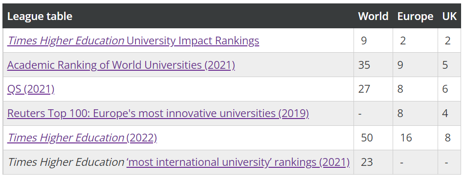

## [University of Manchester](https://www.manchester.ac.uk/)    

  

The University of Manchester is a public research university in Manchester, England. The main campus is south of Manchester City Centre on Oxford Road. The university owns and operates major cultural assets such as the Manchester Museum, The Whitworth (art gallery), the John Rylands Library, the Tabley House Collection, and the Jodrell Bank Observatory—a UNESCO World Heritage Site.
  

The University of Manchester is considered a red brick university, a product of the civic university movement of the late 19th century. The current University of Manchester was formed in 2004 following the merger of the University of Manchester Institute of Science and Technology (UMIST) and the Victoria University of Manchester. This followed a century of the two institutions working closely with one another.
  

The University of Manchester Institute of Science and Technology was founded in 1824 as the Mechanics' Institute. The founders believed that all professions somewhat relied on scientific principles. As such, the institute taught working individuals branches of science applicable to their existing occupations. They believed that the practical application of science would encourage innovation and advancements within those trades and professions. The Victoria University of Manchester was founded in 1851, like Owens College. Academic research undertaken by the university would be published via the Manchester University Press from 1904.
  

The University of Manchester is a member of the Russell Group, the N8 Group, and the worldwide Universities Research Association. The University of Manchester, inclusive of its predecessor institutions, has had 25 Nobel laureates amongst its past and present students and staff, the fourth-highest number of any single university in the United Kingdom. In 2020/21, the university had a consolidated income of £1.1 billion, of which £237.0 million was from research grants and contracts (6th place nationally behind Oxford, UCL, Cambridge, Imperial, and Edinburgh). It has the fifth-largest endowment of any university in the UK, after the universities of Cambridge, Oxford, Edinburgh, and King's College London.

 

*Source: [https://en.wikipedia.org/wiki/University_of_Manchester](https://en.wikipedia.org/wiki/University_of_Manchester)*  

### History  

Some of the world's most important achievements took place at Manchester. Our story is one of the world's first and most brilliant discoveries, with 25 Nobel Prize winners who have worked or studied here.

   

Manchester is the birthplace of nuclear physics, where Ernest Rutherford first split the atom. The world’s first stored-program computer was developed here, and Alan Turing pioneered artificial intelligence during his time at the University.

 

Our observatory at Jodrell Bank is home to the iconic Lovell Telescope – the biggest telescope of its type in the world when it was built. Fittingly, Jodrell Bank will be the central control hub for the world’s largest radio telescope, the Square Kilometre Array.

 

The economist Arthur Lewis became the first black professor at a British university when he joined us and published his most influential works while at Manchester. And Christabel Pankhurst, a Manchester law graduate unable to enter the profession on account of her sex, became one of the suffragette movement’s most committed campaigners.

 

Isolating the properties of graphene won our scientists Andre Geim and Kostya Novoselov the Nobel Prize in Physics in 2010. Lightweight, super-strong and highly conductive, this new wonder material will transform technologies in every walk of life – from solar power and fuel cells to flat-screen devices and disease detection.
With a degree from The University of Manchester, you’ll become a part of this distinguished club, whose collective achievements have shaped the history of the modern world.

  

*Source: [https://www.manchester.ac.uk/study/experience/reputation/history/](https://www.manchester.ac.uk/study/experience/reputation/history/)*
 

### Ranking(2022)  

International rankings compare universities from across the globe for their research performance and academic reputation. The University of Manchester is proud to be among the world’s top 50 universities and one of the world's leading universities for its impact on the UN Sustainable Development Goals (Times Higher Education University Impact Rankings, 2022).

  

  

 
*Source: [https://www.manchester.ac.uk/study/experience/reputation/rankings/](https://www.manchester.ac.uk/study/experience/reputation/rankings/)*
