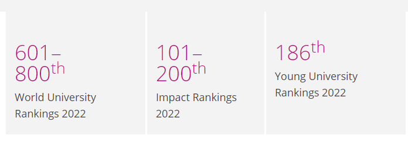

# University Information 
## [University of Manchester](https://www.manchester.ac.uk/)    

  

The University of Manchester is a public research university in Manchester, England. The main campus is south of Manchester City Centre on Oxford Road. The university owns and operates major cultural assets such as the Manchester Museum, The Whitworth (art gallery), the John Rylands Library, the Tabley House Collection, and the Jodrell Bank Observatory—a UNESCO World Heritage Site.
     
 

The University of Manchester is considered a red brick university, a product of the civic university movement of the late 19th century. The current University of Manchester was formed in 2004 following the merger of the University of Manchester Institute of Science and Technology (UMIST) and the Victoria University of Manchester. This followed a century of the two institutions working closely with one another.
     
 

The University of Manchester Institute of Science and Technology was founded in 1824 as the Mechanics' Institute. The founders believed that all professions somewhat relied on scientific principles. As such, the institute taught working individuals branches of science applicable to their existing occupations. They believed that the practical application of science would encourage innovation and advancements within those trades and professions. The Victoria University of Manchester was founded in 1851, like Owens College. Academic research undertaken by the university would be published via the Manchester University Press from 1904.
      
 

The University of Manchester is a member of the Russell Group, the N8 Group, and the worldwide Universities Research Association. The University of Manchester, inclusive of its predecessor institutions, has had 25 Nobel laureates amongst its past and present students and staff, the fourth-highest number of any single university in the United Kingdom. In 2020/21, the university had a consolidated income of £1.1 billion, of which £237.0 million was from research grants and contracts (6th place nationally behind Oxford, UCL, Cambridge, Imperial, and Edinburgh). It has the fifth-largest endowment of any university in the UK, after the universities of Cambridge, Oxford, Edinburgh, and King's College London.

 

*Source: [https://en.wikipedia.org/wiki/University_of_Manchester](https://en.wikipedia.org/wiki/University_of_Manchester)*  

**History**  

Some of the world's most important achievements took place at Manchester. Our story is one of the world's first and most brilliant discoveries, with 25 Nobel Prize winners who have worked or studied here.

      
 

Manchester is the birthplace of nuclear physics, where Ernest Rutherford first split the atom. The world’s first stored-program computer was developed here, and Alan Turing pioneered artificial intelligence during his time at the University.

      
 

Our observatory at Jodrell Bank is home to the iconic Lovell Telescope – the biggest telescope of its type in the world when it was built. Fittingly, Jodrell Bank will be the central control hub for the world’s largest radio telescope, the Square Kilometre Array.

     
 

The economist Arthur Lewis became the first black professor at a British university when he joined us and published his most influential works while at Manchester. And Christabel Pankhurst, a Manchester law graduate unable to enter the profession on account of her sex, became one of the suffragette movement’s most committed campaigners.

     
 

Isolating the properties of graphene won our scientists Andre Geim and Kostya Novoselov the Nobel Prize in Physics in 2010. Lightweight, super-strong and highly conductive, this new wonder material will transform technologies in every walk of life – from solar power and fuel cells to flat-screen devices and disease detection.
With a degree from The University of Manchester, you’ll become a part of this distinguished club, whose collective achievements have shaped the history of the modern world.

      
 

*Source: [https://www.manchester.ac.uk/study/experience/reputation/history/](https://www.manchester.ac.uk/study/experience/reputation/history/)*
 
 
**Ranking(2022)**  

International rankings compare universities from across the globe for their research performance and academic reputation. The University of Manchester is proud to be among the world’s top 50 universities and one of the world's leading universities for its impact on the UN Sustainable Development Goals (Times Higher Education University Impact Rankings, 2022).

      
 

  

 
 

*Source: [https://www.manchester.ac.uk/study/experience/reputation/rankings/](https://www.manchester.ac.uk/study/experience/reputation/rankings/)*

## [Manchester Metropolitan University](https://www.mmu.ac.uk/)

  

    

**Overview and History**      

Manchester Metropolitan University (often abbreviated MMU) is a public research university located in Manchester, England. The university traces its origins to the Manchester Mechanics Institute and the Manchester School of Design, which formed Manchester Polytechnic in 1970. Manchester Polytechnic then gained university status under the government's Further and Higher Education Act, becoming the Manchester Metropolitan University in 1992.    

Manchester Metropolitan University is an accredited member of the Association of MBAs, and a member of the University Alliance, the Association of Commonwealth Universities, the North West Universities Association, the Association to Advance Collegiate Schools of Business, and the European University Association.      

Today, it is also home to the Manchester School of Art, the Manchester School of Theatre, as well as the Manchester School of Architecture (MSA) administered in collaboration with the University of Manchester.   

The University's logo is derived from the upper part of the shield of the university's coat-of-arms, with six spade-irons positioned together, suggesting hard toil and entrenchment.   

_Source: [https://en.wikipedia.org/wiki/Manchester_Metropolitan_University](https://en.wikipedia.org/wiki/Manchester_Metropolitan_University)_     

**Mission**    
We are a great, modern university, in a great global city, here to make an impact on Manchester, our nation, and beyond, with a driving ambition to discover and disseminate knowledge, and make higher education accessible and beneficial to all those with the passion and ability to succeed.     

We work closely with our city, with business, the community, and our academic peers - locally, nationally, and internationally - to be inventive and creative, generate great opportunities and enable our students, colleagues, and everyone whose lives we touch to make an impact.      

_Source: https://www.mmu.ac.uk/about-us/strategy/_    

**Ranking(2022)**      

#801-1000 2022  QS World University ranking    

Time Higher Education ranking:     

  

      

## [University of Salford](https://www.salford.ac.uk/)     

  
  
  

    

The University of Salford is a public university in Salford, Greater Manchester, England, 1 mile (1.6 kilometers) west of Manchester city center. The Royal Technical Institute, Salford, which opened in 1896, became a College of Advanced Technology in 1956 and gained university status in 1967, following the Robbins Report on higher education.      

It has 21,500 students and is on 160 acres (65 hectares) of parkland on the banks of the River Irwell.    

_Source: [https://en.wikipedia.org/wiki/University_of_Salford](https://en.wikipedia.org/wiki/University_of_Salford)_      

**Rankings(2022)**    

  

      

_Source: Wikipedia, from multiple university ranking providers_     

## [Into Manchester](https://www.intostudy.com/) - College/Foundation     

  

    

INTO University Partnerships is a British pathway education provider focused on the provision of foundation courses for international students. The INTO Manchester Study Centre is located in Bridgewater House, an impressive Edwardian building, right in the heart of bustling Manchester. It offers you the chance to study in one of the most exciting and culturally diverse cities in the world.      

The Centre's facilities have been designed with students like you in mind. You can take advantage of well-equipped classrooms and multimedia resources, giving you everything you need to study and socialize in one location. Our academic programs are taught in a similar way to what you'll experience at university and our English language classes are taught in an interactive, inclusive classroom environment to help build your language skills through classroom participation.     

The Centre is also home to our friendly Student Services team, who are on hand to help. They understand the challenges that come with studying abroad and provide a dedicated network of support. From visa and immigration advice to opening your UK bank account; you're in safe hands.  

## Other Universities in Greater Manchester    

- [University of Bolton](https://www.bolton.ac.uk/)
- [University Academy 92](https://ua92.ac.uk/)

