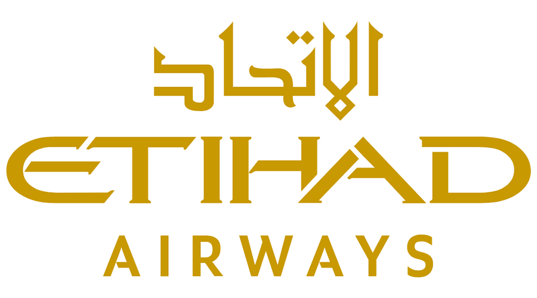
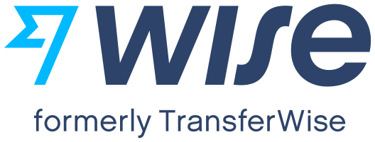

# Departure    
Prior to departure, there are several things you have to pay attention to. 

**Important documents to prepare:**   
Passport, UCAS Papers/CAS Letter, Proof of Accommodation, BRP Pickup Papers, Student finance documents, including bursaries or scholarship.

**You may want to prepare your accommodation prior to the departure:**     
confirm your accommodation, don’t forget to check the move-in date, and have the address ready for the immigration check at the airport.   

**You may want to bring essentials to Manchester such as**   
Personal medication, Indonesian food or spices, socket adaptor, batik and formal wear for any special occasions, and study tools such as a scientific calculator, mask, and antiseptic.  

## Popular Airlines    
Find out the options along with their respective membership information. Here are a few examples.    

### Qatar Airways 

  

   

One of the most popular airline is Qatar Airways, but unfortunately there is no direct flight from Indonesia - Manchester. At least it will need one-time transit in Doha, Qatar. This airline have student club program that might give you benefits such as:   

**Save more with every booking**   
Get 10% off your first booking when you join Student Club, 15% off after your first trip and 20% off after your second. Plus, you can now enjoy a further 20% off after your third.   

**Additional Baggage Allowance**   
Carry more with you. As a Burgundy Student Club member, you can take an additional 10 kgs or one more piece of baggage on flights depending on your route.   

**Complementary Super Wi-fi**   
Book on qatarairways.com or our mobile app and get complimentary high-speed Super Wi-Fi to stay connected on board with the fastest high-speed broadband in the skies. 

**Details**   
[Student Club | Qatar Airways](https://www.qatarairways.com/en-gb/student-club.html?iid=ALL66256220)       

### Etihad Airways     

  

   

Other popular airline is Etihad Airways. Similar with Qatar Airways, this airline have no direct flight from Indonesia - Manchester. At least it will need one-time transit in Abu Dhabi, United Arab Emirates (UAE).   

You'll save up to 10% on Economy tickets and 5% on Business tickets – whether you're travelling for university or other occasion. Moreover, you will get additional checked baggage allowance up to 40 kg in economy and up to 50 kg in business class. You are also eligible to applied this promo to another adult who accompany you in the same booking code.   

**Details:**   
[https://www.etihad.com/en-gb/book/special-offers/promotion/student-special-fares](https://www.etihad.com/en-gb/book/special-offers/promotion/student-special-fares)   

### Emirates    

  

    

The other airline is Emirates. Similar with Etihad, it will require at least 1 stop any flight from Indonesia to Manchester in Abu Dhabi.   

Whether you’re travelling for school or headed for a getaway at any of our over 250 destinations, book your flight by 30 September 2022 using the promo code STUDENT to get discounts of up to 10% on Economy Class and Business Class fares. You also get 10kg more or 1 extra piece on top of our generous baggage allowances and flexible options to change your flight.   

**Details:**  
[Special fares and extras for students | Emirates Special Offers | Emirates](https://www.emirates.com/english/special-offers/student-special-fares/)   

### Other airlines   
1. Singapore Airlines
2. Turkish Airlines 
3. British Airways 
4. Etc 

**Money**   
Bring some cash as needed, but [do not bring more than](https://www.gov.uk/bringing-cash-into-uk) £ 10,000 in cash. Bring debit/credit cards that can be used in the UK for your first few weeks in Manchester as it takes weeks/months to open UK Bank Account.    

**If you need to transfer money from Indonesia**    
there are a few providers, you can use  

    
      

