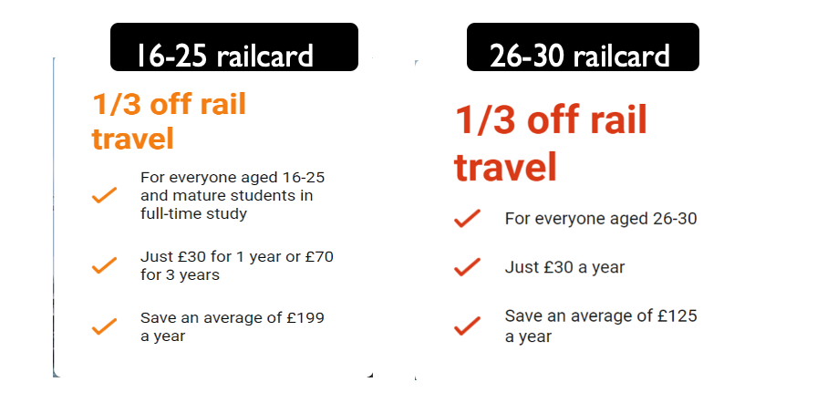

# Transportation    
With a distance that is not too far from one place to another, Manchester is a friendly city for pedestrians and cyclists. Apart from walking, alternative modes of transportation in this city are Tram, Bus, Train, and Uber/Taxi.    

If you live a quiet distance from the University or use the bus a lot, you may want to consider buying Bus Pass Card. There are few buses provider in Manchester, the most popular is Stagecoach, as it covers many locations in Manchester. You will need an ID Card (student card/BRP/Passport) with a photo to buy a Stagecoach student pass. Visit this website for more info about Bus Pass Card.    

If you are planning to travel intercity in the UK during your study, we are recommending purchasing Railcard. It can save up to 1/3 on the price of your train tickets. More info on [Trainline](https://www.thetrainline.com/trains/great-britain/railcards)    

